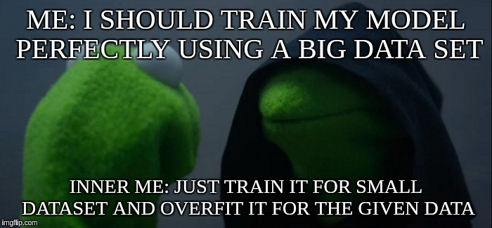
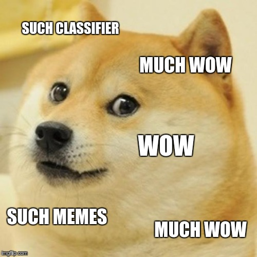

# Meme-Classifier
## A tensorflow project in python to classify given meme

Training done by replacing last layer of Inception model. <br/>
Training has been done using very few images so the accuracy of prediction might be low in some meme templates. <br/>

## Supported Meme templates

*evil kermit <br/>
*bad luck brian <br/>
*good guy greg <br/>
*the most interesting man in the world<br/>
*conspiracy keanu <br/>
*philosoraptor <br/>
*overly attached girlfriend <br/>
*doge <br/>
*one does not simply <br/>
*condescending wonka <br/>
*first world problems girl <br/>
*grumpy cat <br/>
*success kid <br/>
*ancient aliens guy <br/>

## Description

Training has been done by using InceptionV3 model and training the last layer using bottlenecks. <br/>
Install dependencies using pip as `sudo pip install -r requirements.txt` <br/>
You can run the program and find the prediction by using `python classify_meme.py path/to/meme.jpg` <br/>

## Using given test images
1. cd into the directory.
2. Then run `python classify_meme.py memes/meme1.jpg`
3. The model will predict the normalised score as per the template of the meme (5 best results will be given)
4. The results should be somewhat like this for the given meme:


```
evil kermit                 : 0.97493
condescending wonka         : 0.00606
doge                        : 0.00417
good guy greg               : 0.00226
success kid                 : 0.00224
```
5. Test again by running `python classify_meme.py memes/meme2.jpg`
6. The expected result for the given meme would be :

```
doge                        : 0.99790
good guy greg               : 0.00055
one does not simply         : 0.00037
grumpy cat                  : 0.00027
conspiracy keanu            : 0.00014
```
